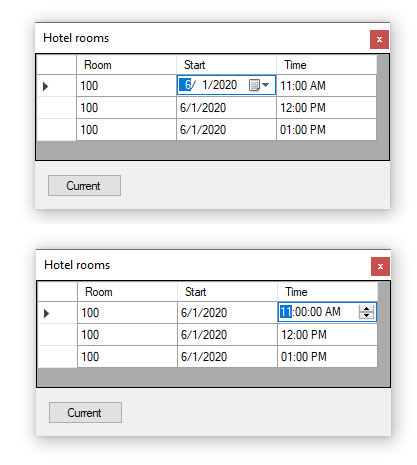

# DataGridView custom columns C#

Code sample for custom calendar and time column reading data with Entity Framework Core 3x. On a similar topic, for how to use a DataGridViewComboBox with Entity Framework Core see the following [Technet article](https://social.technet.microsoft.com/wiki/contents/articles/53881.entity-framework-core-3-projections.aspx).

[Microsoft TechNet article](https://social.technet.microsoft.com/wiki/contents/articles/53930.windows-forms-datagridview-dates-and-numeric-columns-c.aspx)

### SQL-Server database script
The database script found in the Solution items folder must be executed first before running the code.

### NuGet packages
Prior to running the project select restore Nuget packages from the root of Solution explorer.